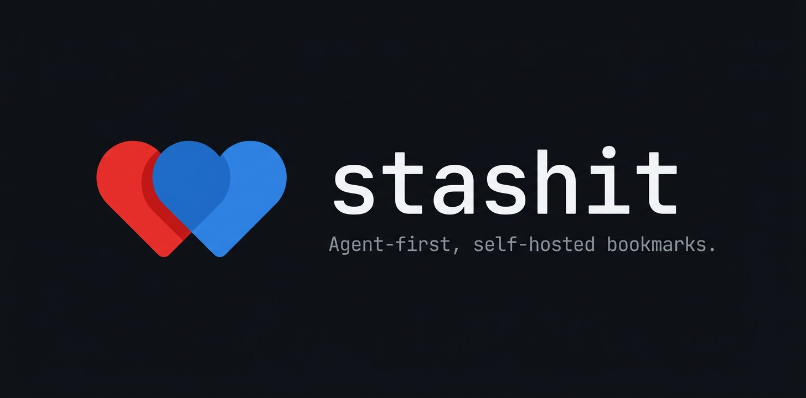

# stashbox



> Agent-first, self-hosted bookmarks. You own the data.

stashbox is a single-user, self-hosted bookmark backend designed to be consumed primarily by AI agents and lightweight clients (CLI, MCP, browser extension, Apple Shortcut). API-first: there is no central web UI in v1.

**Status: pre-alpha — under active development. See [docs/PRD.md](./docs/PRD.md) for the full spec and [issues](https://github.com/Nardjo/stashbox/issues) for what's being built.**

## Why

Existing self-hosted bookmark managers (Linkding, Linkwarden, Karakeep) are UI-centric. stashbox inverts the priority: the API is the product, the clients are thin shells around it. It is the natural memory layer for personal AI workflows — ask your agent _"find me that article about diffusion models I saved last month"_ and get a usable answer.

## Quick start

```bash
git clone https://github.com/Nardjo/stashbox.git
cd stashbox
cp .env.example .env
# Generate APP_KEY:
node -e "console.log(require('crypto').randomBytes(32).toString('hex'))"
# Paste it into .env, then:
docker compose up -d

curl http://localhost:3333/   # → {"ok":true}
docker compose exec api node ace key:create my-laptop
```

Full self-hosting guide (plain Docker, backup/restore): [docs/SELF_HOSTING.md](./docs/SELF_HOSTING.md).
API reference: [docs/API.md](./docs/API.md).

## Planned clients

- HTTP API (AdonisJS + Postgres + pgvector)
- CLI: `stashbox add | search | recent | tag | ...`
- MCP server for Claude Desktop / Code / Cursor
- Chrome extension
- Apple Shortcut

## License

[AGPL-3.0](./LICENSE) — self-host freely, but redistributed/SaaS forks must stay open.
